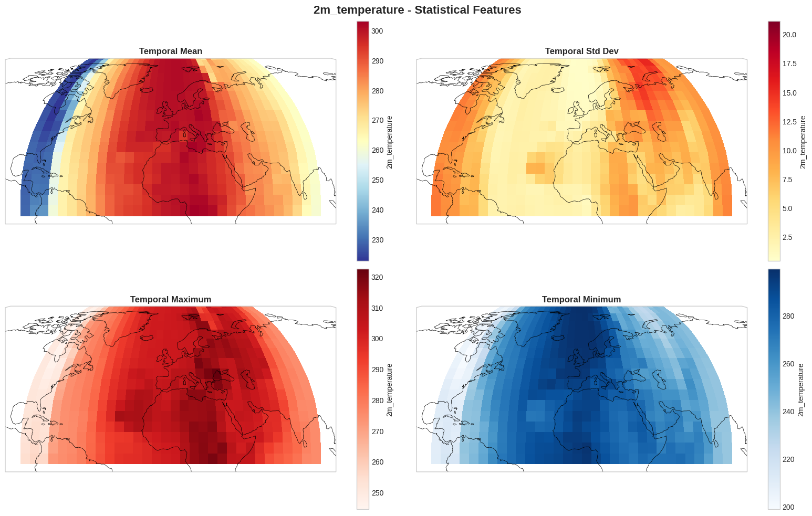

# Weather Prediction

基于深度学习的气象预测系统，支持多种模型架构和预测方式。

**[中文](README.md) | [English](README_EN.md)**

## 📖 项目介绍

本项目是一个基于深度学习的全球天气预测研究项目，主要特点：

- **预测任务**：基于过去3天（12个时间步，6小时间隔）的天气数据，预测未来1天（4个时间步）的天气状况
- **多变量支持**：支持温度、位势高度、风速、比湿等多个气象变量
- **多种模型**：从传统深度学习模型（CNN、ConvLSTM、Transformer）到基于Stable Diffusion的WeatherDiff模块
- **不确定性量化**：通过Diffusion模型支持概率预测和不确定性估计
- **全球覆盖**：基于ERA5全球再分析数据，支持64×32到512×512等多种分辨率

## 📊 数据说明



### 数据源

- **来源**: WeatherBench2 - ERA5再分析数据
- **路径**: `gs://weatherbench2/datasets/era5/1959-2022-6h-64x32_equiangular_conservative.zarr`
- **分辨率**: 64×32等角网格（经度×纬度）
- **经度范围**:[0.00, 354.38]
- **维度范围**:[-87.19, 87.19]
- **时间间隔**: 6小时
- **时间点**: 92044
- **时间范围**: 1959-01-01 到 2021-12-31

### 主要变量

| 变量名 | 说明 | 维度 |
|--------|------|------|
| `2m_temperature` | 2米温度 | (time, lat, lon) |
| `geopotential` | 位势高度 | (time, level, lat, lon) |
| `10m_u_component_of_wind` | 10米U风 | (time, lat, lon) |
| `10m_v_component_of_wind` | 10米V风 | (time, lat, lon) |
| `specific_humidity` | 比湿 | (time, level, lat, lon) |

### 数据格式

```python
# 输入序列
X: (n_samples, input_length, features)
   input_length = 12  # 过去12个时间步（3天）

# 输出序列  
Y: (n_samples, output_length, features)
   output_length = 4  # 未来4个时间步（1天）
```

## 🏗️ 模型架构

项目支持多种模型：

- **Linear Regression**: 快速基线模型
- **CNN**: 卷积神经网络，性能最佳（RMSE=1.20 K），训练快速
- **ConvLSTM**: 时空联合建模，性能优秀（RMSE=1.24 K）
- **LSTM**: 时间序列建模，适合单点预测
- **Transformer**: 序列建模，没有时空信息，适合单点预测 
- **Weather Transformer**: Factorized时空注意力，轻量级设计

基于Stable Diffusion架构，将气象数据视为图像进行预测：

- **Pixel U-Net**: 直接在像素空间预测，性能优异（RMSE=1.25 K）
- **Latent U-Net**: 
  - **SD VAE**: Stable Diffusion预训练VAE（512×512→64×64）
  - **RAE**: Representation Autoencoder，支持多种encoder（DINOv2/SigLIP2/MAE）
- **Diffusion Model**: 概率预测，支持不确定性量化

**详细模型架构请参考 [MODEL.md](MODEL.md) ([English](MODEL_EN.md))**

## 🔬 Latent Codec 重建测试

在使用 Latent U-Net 进行天气预测之前，建议先测试不同 Latent Codec（编码器-解码器）的重建能力，选择最适合天气数据的 codec。

我们提供了完整的重建测试工具，支持：

- **VAE (Stable Diffusion VAE)**: 预训练的 SD VAE
- **RAE (Representation Autoencoder)**: 支持多种 encoder（DINOv2-B, MAE, SigLIP2 等）
- **S-VAE (Hyperspherical VAE)**: 可自定义训练的 VAE


**详细测试结果和完整指标请参考 [reconstruction/README.md](reconstruction/README.md)**

## 📈 评估指标
<!-- 
### VAE重建指标

- **相关系数**: 空间模式相似度
- **SSIM**: 结构相似性指数（图像质量）
- **PSNR**: 峰值信噪比（图像质量） -->

### 确定性指标
- **RMSE** (Root Mean Square Error): 均方根误差，主要指标
- **MAE** (Mean Absolute Error): 平均绝对误差

<!-- ### 概率指标（Diffusion模型）

- **CRPS** (Continuous Ranked Probability Score): 概率分布质量
- **Spread-Skill Ratio**: 集成校准（理想值 ≈ 1.0）
  - < 1.0: 过度自信
  - > 1.0: 不够自信
- **Ensemble Mean RMSE**: 集成平均误差 -->

### 时空分辨指标

- **RMSE vs Lead Time**: 误差随预测步长变化
- **空间误差图**: 不同区域的预测精度
- **时间序列图**: 预测值与真值的时间序列对比


## 🔧 环境配置

### 安装依赖

```bash
# 创建虚拟环境
python3 -m venv venv
source venv/bin/activate

# 安装基础依赖（包含WeatherDiff所需依赖）
pip install -r requirements.txt
```

## 🚀 脚本运行

### 传统模型

```bash
# CNN（推荐，性能最佳）
bash scripts/run_cnn.sh 2m_temperature

# ConvLSTM（时空建模）
bash scripts/run_convlstm.sh 2m_temperature

# Weather Transformer
bash scripts/run_weather_transformer.sh 2m_temperature

# Pixel U-Net
bash scripts/run_pixel_unet.sh 2m_temperature

# VAE (SD) Latent U-Net
bash scripts/run_vae_latent_unet.sh 2m_temperature

# RAE Latent U-Net
bash scripts/run_rae_latent_unet.sh 2m_temperature

# Diffusion模型（概率预测）
bash scripts/run_diffusion.sh
```

**注意**：
- VAE/RAE Latent U-Net需要先预处理数据（脚本会自动处理）
- 大尺寸图像（512×512）建议使用Latent U-Net以节省显存
- 支持混合精度训练（`--use-amp --amp-dtype bfloat16`）和梯度累积（`--gradient-accumulation-steps 2`）

### Latent Codec 重建测试

在使用 Latent U-Net 之前，建议先测试不同 codec 的重建能力：

```bash
# 测试 VAE 重建
python reconstruction/test_vae_reconstruction.py \
    --data-path reconstruction/weather_images \
    --n-test-samples 100

# 测试 RAE 重建（批量测试多个encoder）
cd reconstruction
bash test_rae_reconstruction.sh

# 对比多个 codec 的重建效果
python reconstruction/compare_reconstructions.py \
    --original-dir reconstruction/weather_images \
    --reconstructed-dirs \
        outputs/vae_reconstruction/reconstructed \
        outputs/rae_reconstruction/recon_samples_DINOv2-B/RAE-pretrained-bs4-fp32 \
    --labels VAE RAE-DINOv2-B \
    --output comparison.png
```

详细说明请参考 [reconstruction/README.md](reconstruction/README.md)

## 🔬 实验结果

所有结果均为**物理空间**的评估指标。评估了三个主要气象变量：2米温度、位势高度和比湿。

### 1. 2米温度 (2m_temperature)

| 模型 | MSE | MAE (K) | RMSE (K) | Step 1 | Step 2 | Step 3 | Step 4 |
|------|-----|---------|----------|--------|---------|--------|--------|
| **CNN** ⭐ | 1.446 | 0.753 | **1.203** | 0.768 | 1.061 | 1.309 | 1.535 |
| **ConvLSTM** | 1.542 | 0.758 | 1.242 | 0.736 | 1.091 | 1.365 | 1.604 |
| **Pixel U-Net** ⭐ | - | 0.783 | 1.252 | 0.775 | 1.128 | 1.382 | 1.578 |
| **RAE-MAE_decSmall** | 1.795 | 0.861 | 1.340 | 0.931 | 1.212 | 1.420 | 1.681 |
| **Weather Transformer** | 1.821 | 0.863 | 1.349 | 0.952 | 1.225 | 1.455 | 1.662 |
| **RAE-DINOv2-B_decSmall** | 5.167 | 1.512 | 2.273 | 2.029 | 2.201 | 2.347 | 2.488 |
| LSTM | 6.557 | 1.729 | 2.561 | 2.523 | 2.543 | 2.571 | 2.604 |
| Multi-Output LR | 7.128 | 1.756 | 2.670 | 2.227 | 2.549 | 2.802 | 3.034 |
| Transformer | 11.335 | 2.300 | 3.367 | 3.363 | 3.371 | 3.367 | 3.366 |
| Latent U-Net (SD-VAE) | - | 7.228 | 8.115 | 7.653 | 8.520 | 8.039 | 8.221 |
| Latent U-Net (RAE, MAE) | - | 8.755 | 17.257 | 17.177 | 17.306 | 17.227 | 17.317 |

### 2. 位势高度 (geopotential)

| 模型 | MSE | MAE (m²/s²) | RMSE (m²/s²) | Step 1 | Step 2 | Step 3 | Step 4 |
|------|-----|-------------|--------------|--------|---------|--------|--------|
| **CNN** ⭐ | 37938 | 123.2 | **194.8** | 89.5 | 140.8 | 211.0 | 281.7 |
| **Pixel U-Net** | - | 138.8 | 201.7 | 107.8 | 156.0 | 216.2 | 283.0 |
| **Weather Transformer** | 43920 | 140.5 | 209.6 | 117.6 | 165.9 | 225.9 | 288.6 |
| **ConvLSTM** | 48306 | 133.0 | 219.8 | 77.5 | 148.9 | 236.8 | 330.1 |
| **RAE-DINOv2-B_decSmall** | 210509 | 320.5 | 458.8 | 376.0 | 425.4 | 481.3 | 536.6 |
| Multi-Output LR | 400591 | 416.7 | 632.9 | 364.5 | 540.2 | 699.7 | 829.5 |
| LSTM | 485145 | 501.2 | 696.5 | 673.1 | 685.9 | 703.0 | 723.1 |
| Transformer | 602376 | 547.9 | 776.1 | 762.9 | 770.0 | 779.9 | 791.4 |
| Latent U-Net (SD-VAE) | - | 868.4 | 1011.7 | 758.4 | 888.6 | 1100.9 | 1231.7 |
| Latent U-Net (RAE, MAE) | - | 566.1 | 1268.2 | 1255.5 | 1258.9 | 1267.9 | 1290.3 |

### 3. 比湿 (specific_humidity)

| 模型 | MSE | MAE | RMSE | Step 1 | Step 2 | Step 3 | Step 4 |
|------|-----|-----|------|--------|---------|--------|--------|
| **Pixel U-Net** ⭐ | - | 0.000223 | **0.000451** | 0.000357 | 0.000417 | 0.000480 | 0.000529 |
| **ConvLSTM** | 0.0 | 0.000341 | 0.000530 | 0.000294 | 0.000459 | 0.000588 | 0.000693 |
| **CNN** | 0.0 | 0.000362 | 0.000550 | 0.000332 | 0.000487 | 0.000608 | 0.000701 |
| Pixel U-Net (2) | - | 0.000365 | 0.000560 | 0.000327 | 0.000501 | 0.000622 | 0.000716 |
| **Weather Transformer** | 0.0 | 0.000381 | 0.000583 | 0.000357 | 0.000523 | 0.000645 | 0.000738 |
| Latent U-Net (SD-VAE) | - | 0.000575 | 0.000800 | 0.000564 | 0.000742 | 0.000853 | 0.000980 |
| RAE-DINOv2-B_decSmall | 0.0000009 | 0.000653 | 0.000957 | 0.000908 | 0.000943 | 0.000974 | 0.001000 |
| LSTM | 0.000001 | 0.000780 | 0.001109 | 0.001103 | 0.001107 | 0.001111 | 0.001115 |
| Transformer | 0.000001 | 0.000786 | 0.001120 | 0.001119 | 0.001120 | 0.001120 | 0.001122 |
| Multi-Output LR | 0.000001 | 0.000840 | 0.001196 | 0.001046 | 0.001168 | 0.001250 | 0.001305 |

### 结果分析

#### 最佳模型总结

**2米温度**：
1. **CNN** (RMSE=1.20 K) - 最佳传统模型 ⭐
2. **ConvLSTM** (RMSE=1.24 K) - 次优传统模型
3. **Pixel U-Net** (RMSE=1.25 K) - 最佳WeatherDiff模型 ⭐
4. **Weather Transformer** (RMSE=1.35 K) - 基于ViT的Transformer

**位势高度**：
1. **CNN** (RMSE=194.8 m²/s²) - 最佳模型 ⭐
2. **Pixel U-Net** (RMSE=201.7 m²/s²) - 次优模型
3. **Weather Transformer** (RMSE=209.6 m²/s²)
4. **ConvLSTM** (RMSE=219.8 m²/s²)

**比湿**：
1. **Pixel U-Net** (RMSE=0.000451) - 最佳模型 ⭐
2. **ConvLSTM** (RMSE=0.000530)
3. **CNN** (RMSE=0.000550)
4. **Weather Transformer** (RMSE=0.000583)

#### 关键发现

1. **模型性能对比**：
   - **CNN**在温度和位势高度预测上表现最优，说明简单CNN架构在64×32分辨率下非常有效
   - **Pixel U-Net**在比湿预测上表现最佳，在温度和位势高度上也接近最优
   - **ConvLSTM**在所有变量上都表现稳定，是可靠的baseline
   - **Weather Transformer**表现中等，但在所有变量上都优于传统LSTM和Transformer

2. **WeatherDiff模块表现**：
   - **Pixel U-Net**表现优异，在三个变量上都进入前3名
   - **Latent U-Net (SD-VAE)**在温度预测上表现较差（RMSE=8.12 K），但在位势高度和比湿上表现尚可
   - **Latent U-Net (RAE)**在所有变量上都表现较差，可能需要进一步调优

3. **预测步长分析**：
   - 所有模型均显示误差随预测步长增加而增大（Step 1 → Step 4）
   - 最佳模型在短期预测（6小时）表现优异：
     - 温度：RMSE < 0.8 K
     - 位势高度：RMSE < 90 m²/s²
     - 比湿：RMSE < 0.0004
   - 长期预测（24小时）误差增长明显，但仍可接受

4. **模型选择建议**：
   - **快速部署**：选择CNN，训练快速，在温度和位势高度上性能最优
   - **平衡性能与可扩展性**：选择ConvLSTM或Pixel U-Net
   - **比湿预测**：优先选择Pixel U-Net
   - **大尺寸图像**：选择Latent U-Net（SD-VAE），显存友好
   - **长距离依赖**：选择Weather Transformer

**说明**：
- Step 1-4 分别对应未来6、12、18、24小时的预测
- 所有指标均在物理空间计算
- 温度单位：开尔文 (K)
- 位势高度单位：m²/s²
- 比湿为无量纲量

### 输出结果

训练和预测完成后，结果保存在 `outputs/<model_name>/` 目录：

```
outputs/<model_name>/
├── best_model.pt              # 最佳模型权重
├── config.json               # 训练配置
├── training_history.json     # 训练历史
├── prediction_metrics.json  # 评估指标
├── predictions_data/         # 预测数据（numpy格式）
├── timeseries_*.png          # 时间序列对比图
├── spatial_comparison_*.png  # 空间对比图
└── rmse_vs_leadtime_*.png    # RMSE vs 预测步长
```

## 🔮 Future Work

基于当前实验结果和项目进展，以下是未来可能的研究方向和改进点：

### 1. S-VAE (Hyperspherical VAE) 探索

- **目标**：探索使用超球面分布（von Mises-Fisher 分布）作为潜在空间分布的 S-VAE 在天气预测任务上的性能
- **动机**：超球面分布可能更适合捕获天气数据的周期性特征（如季节循环、日循环等）
- **研究方向**：
  - 对比 S-VAE 与标准 VAE、RAE 在重建和预测任务上的性能
  - 分析超球面潜在空间对天气数据表示的影响
  - 评估不同潜在空间维度对性能的影响
- **参考**：详细实现说明请参考 [reconstruction/SVAE_README.md](reconstruction/SVAE_README.md)

### 2. Diffusion 架构深入探索

- **目标**：系统评估 Diffusion 模型在天气预测任务上的性能，特别是概率预测和不确定性量化能力
- **研究方向**：
  - 对比 DDPM、DDIM、Latent Diffusion 等不同 Diffusion 架构
  - 评估概率预测质量（CRPS、Spread-Skill Ratio 等指标）
  - 探索条件 Diffusion 模型，利用历史观测数据作为条件
  - 研究不同噪声调度策略对预测性能的影响
  - 评估 Diffusion 模型在极端天气事件预测上的表现

### 3. Codec 上限能力验证

- **目标**：通过过拟合实验验证不同 codec（VAE、RAE、S-VAE）的最大重建能力上限
- **研究方法**：
  - 在小规模数据集上进行过拟合训练，观察重建误差的下限
  - 分析不同 codec 的理论容量和实际表现
  - 评估潜在空间维度对重建能力的影响
  - 对比不同 codec 在相同条件下的最优性能
- **意义**：确定各 codec 的性能上限，为模型选择提供理论依据

### 4. 多变量关系探索

- **现状**：当前主要关注单变量预测（温度、位势高度、比湿等独立预测）
- **未来方向**：
  - **多变量联合预测**：同时预测多个相关变量，利用变量间的物理关系
  - **变量间依赖建模**：探索如何显式建模变量间的物理约束（如温度-位势高度关系、风场-压力场关系等）
  - **多变量 Latent Codec**：设计能够同时编码多个变量的 codec，在潜在空间中保持变量关系
  - **物理约束集成**：引入物理定律作为约束（如质量守恒、能量守恒等）
  - **变量重要性分析**：研究不同变量对预测任务的贡献度

### 5. 更多模型架构探索

- **Graph Neural Networks (GNN)**：
  - 将全球网格建模为图结构，利用 GNN 捕获空间关系
  - 特别适合处理不规则网格和局部特征
- **Neural ODE/Neural SDE**：
  - 将天气演化建模为连续动力系统
  - 可能更适合长期预测和物理一致性
- **Hybrid 架构**：
  - 结合 CNN、Transformer、Diffusion 等不同架构的优势
  - 探索多尺度特征融合策略
- **Attention 机制改进**：
  - 探索 Factorized Attention、Linear Attention 等高效注意力机制
  - 研究时空注意力在天气预测中的最佳设计
- **Memory-Augmented Networks**：
  - 引入外部记忆模块，存储长期天气模式
  - 可能有助于捕获季节性和长期趋势

### 6. 其他研究方向

#### 6.1 更长预测时间范围
- 当前预测 1 天（4 个时间步），扩展到 3-7 天甚至更长时间范围
- 研究长期预测中的误差累积和模式衰减问题

#### 6.2 更高分辨率支持
- 当前主要使用 64×32 分辨率，扩展到 128×64、256×128 甚至 512×256
- 评估高分辨率下的计算效率和性能提升

#### 6.3 集成学习和模型融合
- 探索多个模型的集成预测（Ensemble）
- 研究不同模型预测结果的融合策略
- 评估集成方法对预测稳定性和准确性的提升

#### 6.4 物理约束和可解释性
- 引入物理约束损失函数，确保预测结果符合物理定律
- 开发可解释性工具，分析模型学到的天气模式
- 可视化模型关注的关键区域和特征

#### 6.5 极端天气事件专门建模
- 针对极端天气事件（台风、暴雨、寒潮等）设计专门的模型
- 研究不平衡数据下的训练策略
- 评估模型在极端事件预测上的表现

#### 6.6 实时预测和在线学习
- 探索在线学习策略，使模型能够适应新的观测数据
- 研究增量学习和持续学习在天气预测中的应用
- 优化推理速度，支持实时预测需求

#### 6.7 跨数据集泛化
- 评估模型在不同数据集（如不同时间范围、不同区域）上的泛化能力
- 研究域适应和迁移学习策略
- 探索少样本学习在天气预测中的应用

## 📚 参考文献

### 数据和基准
- [WeatherBench2](https://weatherbench2.readthedocs.io/) - 天气预测基准
- [ERA5](https://www.ecmwf.int/en/forecasts/datasets/reanalysis-datasets/era5) - ECMWF再分析数据

### 模型论文
- [ConvLSTM](https://arxiv.org/abs/1506.04214) - Shi et al., 2015
- [Transformer](https://arxiv.org/abs/1706.03762) - Vaswani et al., 2017
- [U-Net](https://arxiv.org/abs/1505.04597) - Ronneberger et al., 2015
- [DDPM](https://arxiv.org/abs/2006.11239) - Ho et al., 2020
- [Stable Diffusion](https://arxiv.org/abs/2112.10752) - Rombach et al., 2022
- [RAE](https://arxiv.org/abs/2510.11690) - Boyang Zheng et al., 2025

## 📧 联系方式

如遇问题或有建议，欢迎提Issue或PR。

---

更多模型架构细节请参考 [MODEL.md](MODEL.md) ([English](MODEL_EN.md))
